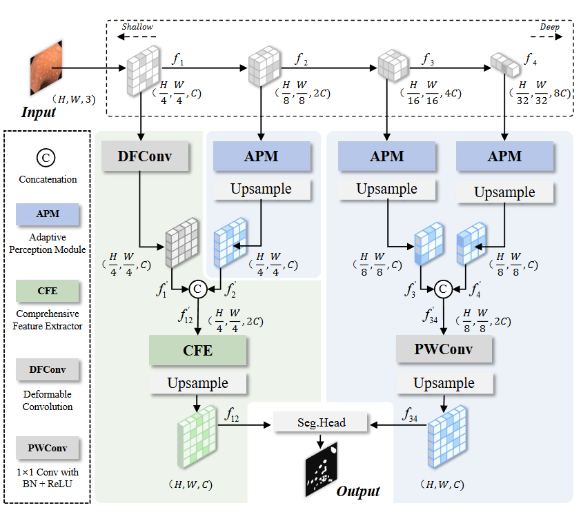
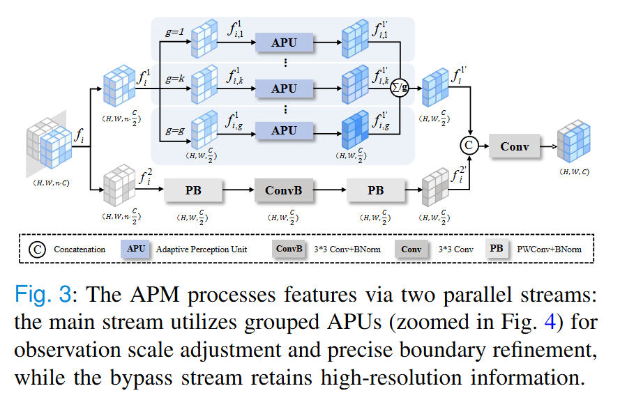
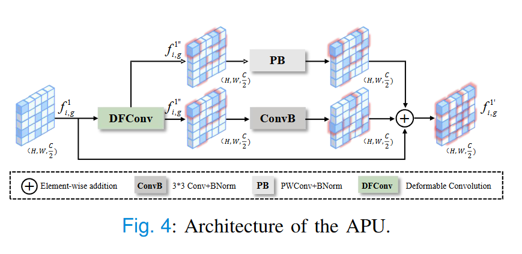
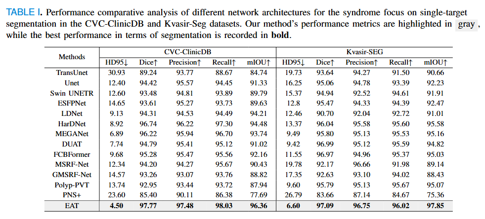
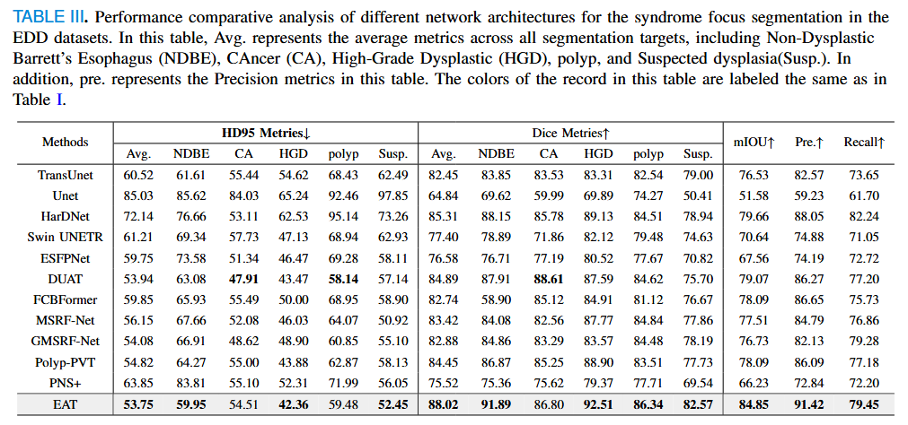
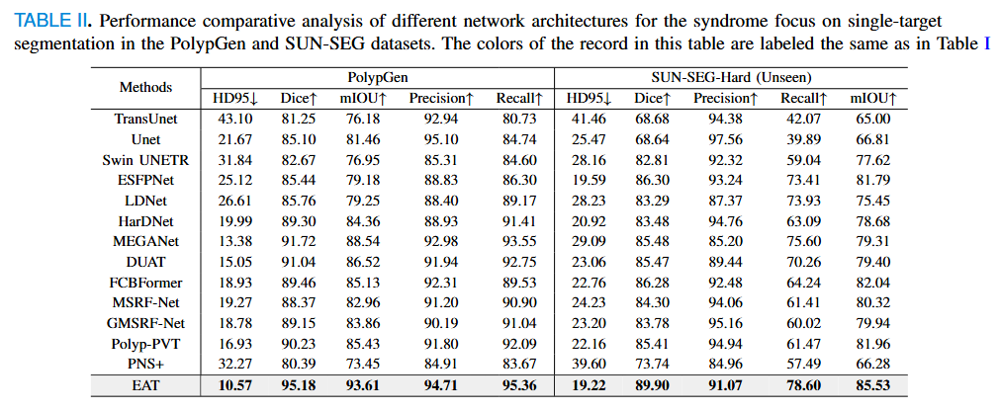
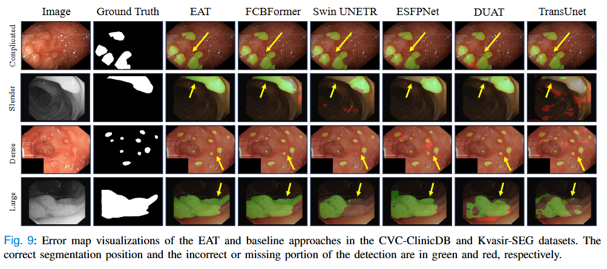
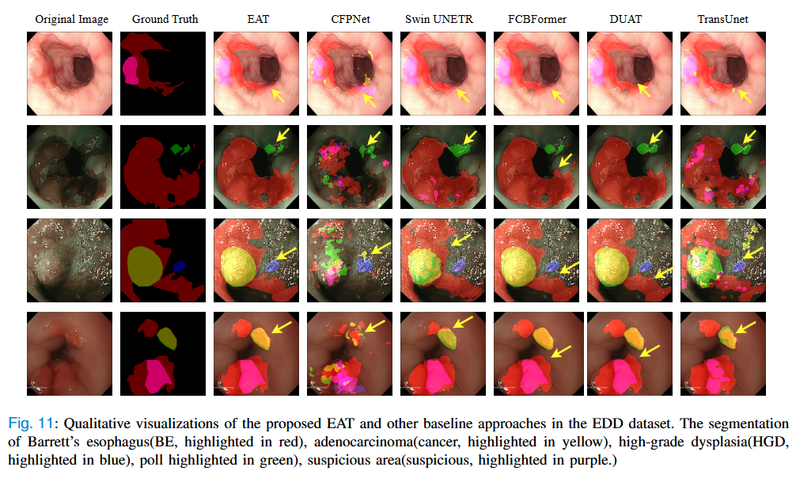

# Endoscopic Adaptive Transformer (EAT) for Enhanced Polyp Segmentation

> More details of this project will be released soon.
&nbsp;

[CVCliniDB weights & logs](https://huggingface.co/deepang/eat/tree/main/CVCliniDB)

[EDD2020 weights & logs](https://huggingface.co/deepang/eat/tree/main/EDD2020)

[Kvasir weights & logs](https://huggingface.co/deepang/eat/tree/main/Kvasir)

[POLYPGEN weights & logs](https://huggingface.co/deepang/eat/tree/main/POLYPGEN)

[SUN-SEG weights & logs](https://huggingface.co/deepang/eat/tree/main/SUN-SEG)

---

## 🔍 Main Contributions  
- **Endoscopic Adaptive Transformer (EAT)**: A hierarchical framework leveraging adaptive perceptive-field mechanisms to handle polyp morphology variability.  
- **Adaptive Perception Module (APM)**: Uses parallel Adaptive Perception Units (APUs) to capture edge features and structural context via deformable convolution.  
- **Comprehensive Feature Extractor (CFE)**: Integrates global context and local details through self-attention mechanisms.  
- **State-of-the-Art Performance**: Validated on 5 datasets with superior accuracy and robustness.  

---

## 🧠 Network Architecture  
### Overview
EAT employs a Pyramid Vision Transformer (PVT) backbone for multi-scale feature extraction. The architecture processes shallow features with deformable convolution and deeper features via APM, followed by CFE-based fusion:  

  

**Key Innovations**:  
- **APM** adjusts observational scope dynamically to match polyp morphology.  
- **Deformable convolution** enhances boundary precision in shallow layers.  
- **Dual-stream fusion** balances high-resolution details and semantic context.  

### APM(Adaptive Perception Module)

### APU(Adaptive Perception Unit)

---

## 📊 Performance  
### Single-Target Segmentation
####  CVC-ClinicDB & Kvasir-SEG

####  PolypGen & SUN-SEG-Hard(Unseen)

### Multi-Target Segmentation
####  EDD 2020

---

### 📂 Data Description

We evaluate our model on five benchmark datasets with rigorous data partitioning protocols to ensure reproducibility and fair comparison:

### Dataset Name: CVC-ClinicDB

Size: 612 colonoscopy images (384×288)

Challenge: Polyp segmentation in colonoscopy images

- **Split**: 80% training / 10% validation / 10% testing
- High-quality annotated polyp images for medical diagnosis

### Dataset Name: Kvasir-SEG

Size: 1,000 annotated endoscopic images

Challenge: Gastrointestinal polyp segmentation

- **Split**: 80% training / 10% validation / 10% testing
- Comprehensive polyp segmentation benchmark dataset

### Dataset Name: EDD 2020

Size: 386 GI tract frames with 5 lesion types (160 NDBE, 88 Susp., 74 HGD, 53 Cancer, 127 Polyp masks)

Challenge: Endoscopy Disease Detection and Segmentation

- **Split**: 80% training / 10% validation / 10% testing
- Multi-target segmentation with various gastrointestinal lesions

### Dataset Name: PolypGen

Size: Multi-center dataset (3,762 polyp-positive frames)

Challenge: Cross-center polyp segmentation generalization

- **Split**: Cross-center evaluation design
- **Training**: Centers data1-data5 (comprehensive training set)
- **Testing**: Center data6 (completely unseen test set)

### Dataset Name: SUN-SEG

Size: 158,690 colonoscopy frames (49,136 polyp-positive + 109,554 negative from 285 polyp-positive and 728 normal video clips)

Challenge: Large-scale colonoscopy polyp segmentation

- **Split**: Official dataset partition
- **Test Set**: SUN-SEG-Hard (Unseen) subset
- **Challenge**: Includes artifact-rich frames for robust evaluation

---

### 🎨 Visualization  
#### Single-Target Segmentation  

#### Multi-Target Segmentation  

---
